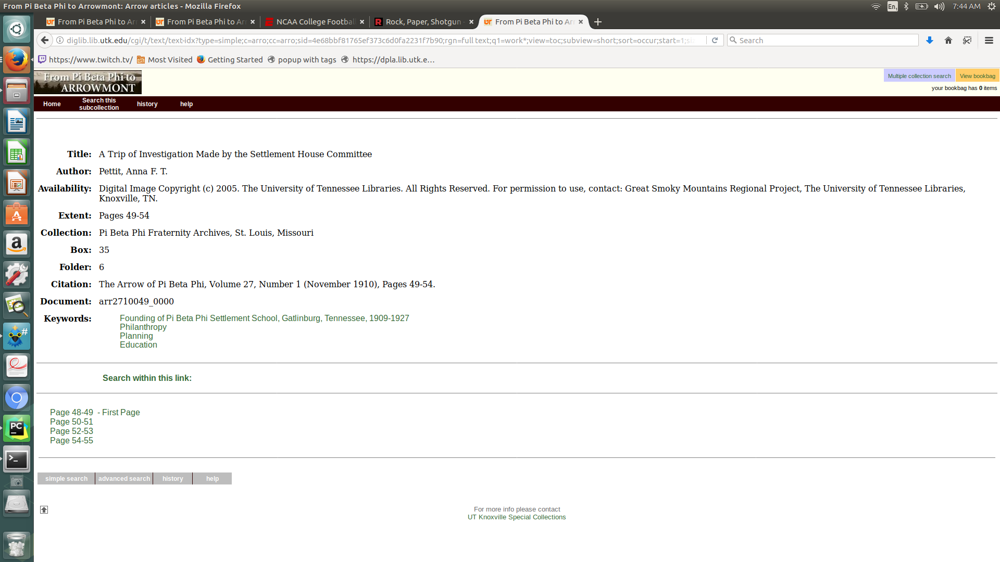
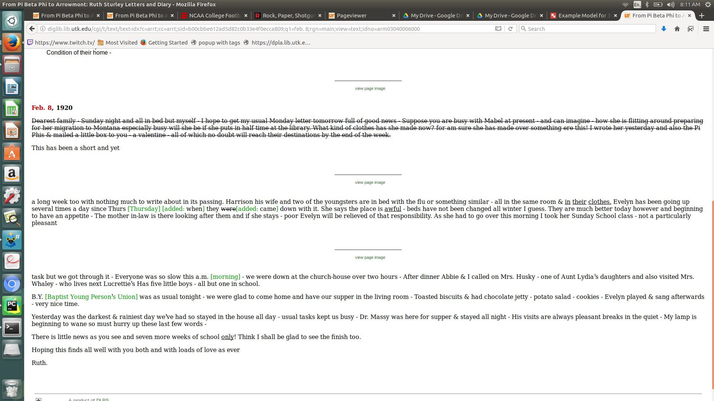

# Arrowmont Migration Discussion by Nark Baggett


## Intro

Arrowmont is made up of numerous content models, mime types, and related materials. Most of these are discussed below.

Because this is a migration and our primary focus is on managing the digital assets, the document focuses on these 3 questions:

1. What do we have
2. What do we currently deliver
3. What can we do for migration

Look and feel may be mentioned, but is not the focus of the document. If you're curious on how to relate this to "look and feel," start with [Louisa's Content Models document](https://wiki.lib.utk.edu/display/DLP/Content+Models).


## 3D Objects

#### What do we have?

##### Tiffs:
These aren't on data, but are here:
* central:/d1/area4/arrowmont-future-transcription/360_archival_tiff

**Example File Structure**
```
|- arbuckle_tiff
	|- arbuckle001_10.TIF
	|- arbuckle001_11.TIF
	|- arbuckle001_12.TIF
	|- arbuckle001_1.TIF
	|- thumbs.db
```

##### Moving Images

Path: data:/arc1/gsmrp/arr/3D/360images_from_www

```
|- arbuckle.mov
|- aunty_rotate.mov
|- Blain_rotate.mov
|- bringle_rotate.mov
```

##### Metadata

No metadata other than what is in here:
http://www.lib.utk.edu/arrowmont/gallery.htm

**Note**:  Metadata is not in DOM.  It's in the thumbnail.

#### What do we currently deliver?

We deliver the .movs and derivative .jpgs here:
http://www.lib.utk.edu/arrowmont/gallery.htm


##### Example of 360s:


#### What can we do?

##### If we focus on the TIFFs?

**Compound Object with Large Images**

Create a compound object for each set of TIFFs.

If we do this we need:

1. Metadata for the compound object
2. Metadata for the images
3. **Note**: Could create a .MOV datastream and link to these from the compound object


##### Example Content Model (Yes, There should be more datastreams here.)


#### If we focus on the .MOVs

Treat them as video:

1. Convert .movs to something that can play in player
2. Metadata for each .mov
3. If we do this, what do we do with the TIFFs?
	4. Drop Them?
	5. Add them as binaries to the Video Object?

##### Example Content Model (Missing Datastreams)


## Articles

#### What do we have?

* TIFFs:
	* data:/arc1/gsmrp/arr/Articles/tiffs
		* article_page.tif
		* The tiffs aren't one page.  They digitized multiple pages together
* TEI:
	* data:/arc1/gsmrp/arr/Articles/OCR_TEI
		* article_0000.xml
			* You could grab the text (OCR) of the images here: /text/body/div1[@type=letter]/pb[@ref = page number]
* Metadata:
	* data:/arc1/gsmrp/arr/arr-OAI
		* article_0000.xml
	* Dublincore

#### What do we currently deliver?

* A metadata record with links to JPGs of 2 scanned pages stitched together.
* [Example article](http://diglib.lib.utk.edu/cgi/t/text/text-idx?type=simple;c=arro;cc=arro;sid=4e68bbf81765ef373c6d0fa2231f7b90;rgn=full%20text;q1=work%2A;view=toc;subview=short;sort=occur;start=1;size=25;idno=arr2710049_0000)

##### View from Metadata / Landing Page


##### View of Page Delivery


#### What can we do?

* If we migrate everything as it is, do it as book with a Transcript.

##### Book Content Model


**Problems**:

* The stitched pages will still be together in book viewer.
* OCR as it's done currently is tied to the stitched pages.
* No compound object.  Paged content can't live on its own.

## Diary

#### What do we have?

* 1 TEI document (real TEI)
	* data:/arc1/gsmrp/arr/Diary/TEI
* TIFFs for the pages:
	* data:/arc1/gsmrp/arr/Diary/tiffs
	* also, two weird ones:
		* arm71000001056a_Tim.tif
		* rsd041a.tif
* 1 Metadata Record as DC
	* data:/arc1/gsmrp/arr/arr-OAI

#### What do we currently deliver?

We deliver the Diary as TEI [here](http://diglib.lib.utk.edu/cgi/t/text/text-idx?c=arrt;view=text;rgn=main;idno=arm71000001000&q1=diary&op2=&q2=&op3=&q3=&rgn=main) with links to each image.

##### Example that shows some TEI Markup


##### Example of the Pages

#### What can we do?

##### Manuscript

* Take the TEI and the Images and Use the Manuscript solution pack?
* **Problems**:
	* We've never done that before. We'd have to do some work on the transforming of the TEI to HTML for delivery to do like what's in the image above.


##### Book

* Put the Manuscript online as book
* Create a transcript by:
	* Match on the page breaks in the TEI document
	* Pull out the text()
	* Convert this to text and strip out the extra TEI
    * Stitch it together.
* Keep TEI as a datastream for legacy purposes.


## Letters

#### What do we have?

* TEI (Real TEI)
	* data:/arc1/gsmrp/arr/Letters/TEI
* TIFFS
	* data:/arc1/gsmrp/arr/Letters/tiffs
* Metadata
	* data:/arc1/gsmrp/arr/arr-OAI


#### What do we currently deliver?

We delivery the letters as TEI [here](http://diglib.lib.utk.edu/cgi/t/text/text-idx?c=arrt;cc=arrt;sid=b00cbbe612ad5d82c0b33e4f0ecca809;q1=feb.%208;rgn=main;view=text;idno=arm03040006000) with links to the page images.

##### Example of TEI Display



##### Example of Page Display


#### What can we do?

##### Manuscript

* Take the TEI and the Images and Use the Manuscript solution pack?
* **Problems**:
	* We've never done that before. We'd have to do some work on the transforming of the TEI to HTML for delivery to do like what's in the image above.

##### Book

* Put the Manuscript online as book
* Match on the page breaks in the TEI document, pull out the xml, try to convert this to text and try to strip out the extra TEI.
* Keep TEI as a datastream for legacy purposes.

## Scrapbooks

#### What do we have?

* tiffs
	* data:/arc1/gsmrp/arr/Scrapbooks/tiffs
* original xml
	* data:/arc1/gsmrp/arr/Scrapbooks/orig_xml
	* This has brief, non schema validated metadata for each page and each image on each page

```
|-- arrs0003_0088_0001.xml
|-- arrs0003_0088_0002.xml
|-- arrs0003_0088.xml
```

##### Metadata for Page


##### Metadata for Images on Page


* oai dc for each scrap book
	* /arc1/gsmrp/arr/arr-OAI

```
|-- arr-OAI/arrs0001.xml
|-- arr-OAI/arrs0002.xml
|-- arr-OAI/arrs0003.xml
|-- arr-OAI/arrs0004.xml
|-- arr-OAI/arrs0005.xml
```

#### What do we currently deliver?

The scrapbooks are done differently.  2 are simple: Compound like objects with pages in scrapbooks.  The other 3 are more complicated compound objects. Images in Pages in Scrapbooks.

We deliver each scrapbook separately with metadata just about the scrapbook.  Here is an example of a scrapbook that displays both pages and images on pages. [Here is an example.](http://diglib.lib.utk.edu/cgi/i/image/image-idx?c=arrs;view=entry;subview=detail;cc=arrs;entryid=x-arrs0005_0005_0001;viewid=1;sid=ef9fff9931f26ed5d0602e57b9faf036)

##### Scrapbook Page Image


##### Scrapbook Image on Page


#### What can we do

##### Compound Object

* Compound Object would be the DC metadata record.
* The parts:
	* Do the pages as large image.
	* Write a transform to create metadata off of the orig. xml (both the page and the part?)
* What about the images in page?
	* Could drop
	* Keep them as binaries
	* Put them in as simple images and link them to the pages via MODS or RDF?


##### Book

* Meh....


## Simple Images

#### What do we have?

* tiffs
	* /arc1/gsmrp/arr/SimpleImages/tiffs
* metadata
	* /arc1/gsmrp/arr/arr-OAI

#### What do we currently deliver?

Metadata and Thumbnail with a Link to a Full JPG. [Here is an Example.](http://diglib.lib.utk.edu/cgi/i/image/image-idx?q1=arrp;sid=01663fc726865bfd9f08ef6798f0983e;rgn1=All%20Categories;g=pbph;med=1;size=20;c=arrp&lasttype=boolean;view=entry;lastview=thumbnail;subview=detail;cc=arrp;entryid=x-aai0004;viewid=AAI0004;start=1;resnum=4)

##### Example Landing Page


##### Example Full View


#### What can we do

**Large Image** is the obvious answer here.  There are no hurdles.

## Other Stuff

Arrowmont was a large IMLS grant. The grant provided many more things than delivery and digitization of cultural heritage materials. These things can all be found [here](http://www.lib.utk.edu/arrowmont/?_ga=2.119595528.1281533654.1509979651-1413165338.1495021793).

### Curriculum Documents

#### What do we have?

* On the website:
	* HTML
	* PDFs

### Historical Essays

* On the website:
	* HTML
	* PDFs

### Timeline

* On the website:
	* One massiveimage that needs to be broken into something else for delivery if we want to keep this (timeline.js?)